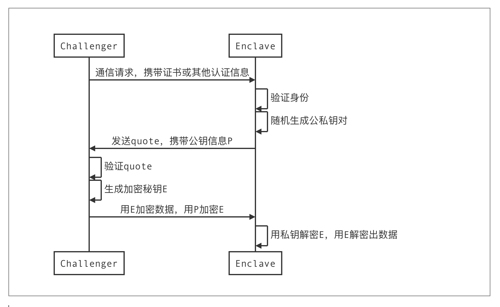

### 远程认证

非对称的认证方式。产生 Quote（**MRENCLAVE、ISVSVN、MRSIGNER、ATTRIBUTES、USERDATA**等）

EPID是一个群签名方案，为了隐藏某一个platform的秘钥信息。

#### quote enclave

验证report并且利用EPID key签名，产生的最终凭证为quote.

quote可以携带一些user data，比如Enclave临时生成的公钥，可以用来标识Enclave的身份，同时用于client与Enclave间进行安全通信和隐私数据传输

Debug Enclave不是受硬件保护的

